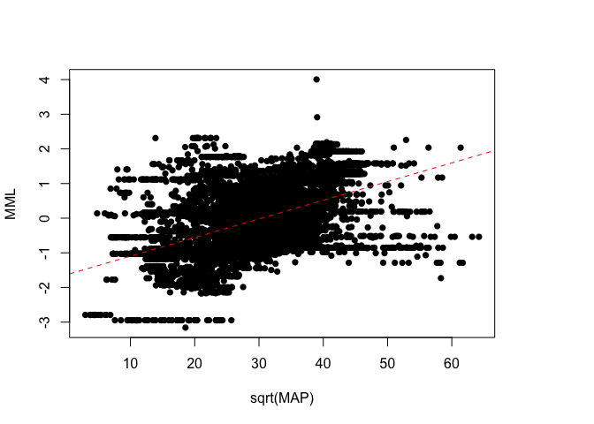
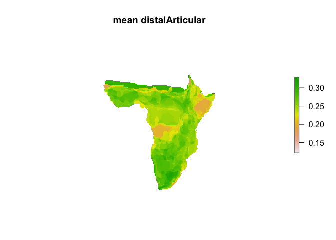

# maps-bovid-ecometrics
Andrew Barr  

**Note:** the precipitation and land cover rasters required to run this analysis are too large for github and are available upon request from the author

## Preliminaries


```r
library(rgdal)
library(rgeos)
library(maptools)
library(dplyr)
library(raster)
library(tidyr)
library(reshape2)
library(GISTools)

par.original <- par(no.readonly=TRUE)

summarize_regression <- function(model, round=2, label=""){
  mod_summary <- summary(model)
  return(knitr::kable(data.frame(
    label=label,
    intercept=round(mod_summary$coefficients[1,1],round),
    SEI=round(mod_summary$coefficients[1,2],round),
    slope=round(mod_summary$coefficients[2,1],round),
    SES=round(mod_summary$coefficients[2,2],round),
    r2 = round(mod_summary$adj.r.squared,round)
    )))
}

summarize_ANOVA <- function(model, round=2, label=""){
  mod_summary <- summary(model)
  return(knitr::kable(data.frame(
    label=label, 
    ## a litte tricky to get correct coeffs
    # because the coefficients are in the original order, even though I used a ordered factor in the lm()
    forest=round(mod_summary$coefficients[1,1],round),
    wetland=round(mod_summary$coefficients[6,1],round),
    woodySav=round(mod_summary$coefficients[3,1],round),
    sav=round(mod_summary$coefficients[4,1],round),
    openShrub=round(mod_summary$coefficients[2,1],round),
    grass=round(mod_summary$coefficients[5,1],round),
    barren=round(mod_summary$coefficients[7,1],round),
    r2 = round(mod_summary$adj.r.squared,round)
    )))
}
```

## Load africa


```r
#get base file path to load data files...assumes file paths are from perspective of directory containing this file
base_path <- getwd()
africa <- readOGR(paste0(base_path,"/africa_shp/africa.shp"), "africa")
```

## Load bovids and merge based on taxonomic name


```r
bovids <- readOGR(paste0(base_path,"/IUCN-Redlist/AFRICAN_BOVIDS.shp"), "AFRICAN_BOVIDS")
```

```
## OGR data source with driver: ESRI Shapefile 
## Source: "/Users/wabarr/Dropbox/EcomorphEcometric/ecomorph-ecometric-r/bovid-locomotor-ecometrics-SHARED-CODE-EER/IUCN-Redlist/AFRICAN_BOVIDS.shp", layer: "AFRICAN_BOVIDS"
## with 424 features
## It has 26 fields
```

```r
bovids <- spTransform(bovids, proj4string(africa))

mergedBovidPolys <- unionSpatialPolygons(bovids, IDs = bovids@data$id_no)
mergedBovidAttributes <- group_by(bovids@data, id_no) %>% summarize(binomial = unique(binomial))
class(mergedBovidAttributes) <- "data.frame"
rownames(mergedBovidAttributes) <- mergedBovidAttributes$id_no
bovids <- SpatialPolygonsDataFrame(mergedBovidPolys, mergedBovidAttributes)
rm(mergedBovidAttributes,mergedBovidPolys)

#eliminate outlier taxa, because they are is usually the only taxon in the community and are north of Sahara
##
outliers <- c(which(bovids@data$binomial == "Ammotragus lervia"), which(bovids@data$binomial == "Gazella cuvieri"), which(bovids@data$binomial == "Addax nasomaculatus"))
bovids <- bovids[-outliers,]
```


## Make raster 


```r
africaRaster <- raster(extent(africa), res=c(50000,50000), crs=CRS(proj4string(africa)))
africaRaster <- mask(africaRaster, africa)
```

## Compute bovid species richness


```r
bovidRichness <- rasterize(x=bovids, y=africaRaster, fun='count', field="id_no")
plot(bovidRichness, axes=F, box=F, main="Bovid Species Richness")
```

<!-- -->


## Get data from sqlite ecomorph database, clone of production ecomorph database on webfaction


```r
joinedDFs <- read.table("all_ecomorphic_data.csv", sep=",", header=T)
bovids@data$B <- joinedDFs$B/joinedDFs$geomeans
bovids@data$DistRad <- joinedDFs$DistRad/joinedDFs$geomeans
bovids@data$ProxRad <- joinedDFs$ProxRad/joinedDFs$geomeans
bovids@data$MML <- joinedDFs$MML/joinedDFs$geomeans
bovids@data$WAF <- joinedDFs$WAF/joinedDFs$geomeans

bovids@data$relMidshaftWidth <- joinedDFs$relMidshaftWidth
bovids@data$relMetarsalLength <- joinedDFs$relMetarsalLength
bovids@data$relMetatarsalDepth <- joinedDFs$relMetatarsalDepth
bovids@data$medialVert <- joinedDFs$medialVert
bovids@data$distalArticular <- joinedDFs$distalArticular
```


## Load MAP raster


```r
MAP <- raster(paste0(base_path,"/globalMAP_2point5_arcseconds.grd"))
MAP <- projectRaster(MAP, africaRaster)
```


## Load land cover raster


```r
landCover <- raster(paste0(base_path,"/AFRICA_LandCover.TIFF"))
landCover <- projectRaster(landCover, africaRaster, method="ngb")
values(landCover)[values(landCover) %in% c(0, 1, 3, 4, 5, 6, 12, 13, 14)] <- NA
#method = 'ngb' refers to nearest neighbor, useful for categorical rasters
```


## function to do a single variable


```r
doEcometricAnalysis <- function(var, 
                                originalMAP, 
                                originalLandCover, 
                                savePlots=FALSE, 
                                dir=base_path, 
                                width=5, height=5, 
                                cex.main=1.75, 
                                plotLabel=NULL, 
                                scaleBar=FALSE,
                                northArrow=FALSE,
                                returnLMs=TRUE,
                                writeEcometricRaster=FALSE) {
  stopifnot(var %in% names(bovids@data))
  ecometric <- rasterize(x=bovids, 
                         y=africaRaster, 
                         fun=function(x, ...) {mean(x, na.rm=TRUE)}, 
                         field=var)
  plot(ecometric,axes=F,box=F, main=paste("mean", var))
  if(writeEcometricRaster) writeRaster(ecometric, paste0(base_path,"/ecometricRasters/",var,".tif"), overwrite=TRUE)

  MAP <- mask(originalMAP, ecometric)
  
  MAPlm <- lm(scale(values(ecometric))~sqrt(values(MAP)))
  summary(MAPlm)
  plot(scale(values(ecometric))~sqrt(values(MAP)), pch=16, xlab="sqrt(MAP)", ylab=var)
  abline(reg=MAPlm, col="red", lty=2)
  
  landCover <- mask(originalLandCover, ecometric)
  landCoverFactor <- factor(values(landCover))
  levels(landCoverFactor) <- c("Evergreen\nBroad. Forest",
                               "Open\nShrub.",
                               "Woody\nSavannas",
                               "Savannas",
                               "Grasslands",
                               "Perm.\nWetland",
                               "Barren")
  landCoverFactor <- ordered(landCoverFactor, 
                     levels=c("Evergreen\nBroad. Forest", "Perm.\nWetland","Woody\nSavannas", "Savannas","Open\nShrub.","Grasslands",  "Barren"))
  plot(scale(values(ecometric))~landCoverFactor, col=(terrain.colors(7)), las=2, xlab="", ylab="", main=var)
  box()

    
  if(savePlots){
    pdf(file = paste0(dir,"/",var,".pdf"), width=width, height=height)
    plot(scale(ecometric), axes=FALSE, box=F)
    text(1636265, 3249920, labels=ifelse(is.null(plotLabel), var, plotLabel), cex=cex.main)
    if(scaleBar){      
      scalebar(c(-1795336,-911192.4), d=1000000, divs=2, label="1000 km", adj=c(0,-1),type="bar")
      north.arrow(-1198181, -1670000,len = 100000, lab = "N")
    }
    dev.off()
    
    pdf(file = paste0(dir,"/",var,"-MAPscatterplot.pdf"), width=width, height=height)
    plot(scale(values(ecometric))~sqrt(values(MAP)), pch=16, xlab="sqrt(MAP)", ylab=ifelse(is.null(plotLabel), var, plotLabel), main=ifelse(is.null(plotLabel), var, plotLabel), cex.main=cex.main)
    abline(reg=MAPlm, col="red", lty=5, lwd=3)
    dev.off()
    
    pdf(file = paste0(dir,"/",var,"-landcoverBoxplots.pdf"), width=width*1.8, height=height)
    plot(scale(values(ecometric))~landCoverFactor, col=(terrain.colors(7)), xlab="", ylab="", main=ifelse(is.null(plotLabel), var, plotLabel), cex.main=cex.main, cex.lab=0.5)
    dev.off()

    }
  
  print(summarize_regression(MAPlm, 2, label=sprintf("MAP~%s", var)))
  
  options(contrasts = c("contr.treatment", "contr.treatment")) #nesseary to have treament contrasts for ordered factors
  LClm <- lm(scale(values(ecometric))~landCoverFactor)
  print(summarize_ANOVA(LClm, 2, label=sprintf("LC~%s", var)))
  if(returnLMs) return(list(unscaledLC=lm(values(ecometric)~landCoverFactor), 
                            unscaledMAP=lm(values(ecometric)~sqrt(values(MAP)))
                            )
                      )
  }
```


## B


```r
resB <- doEcometricAnalysis("B", MAP, landCover, savePlots = F)
```

<!-- --><!-- --><!-- -->

label    intercept    SEI   slope   SES    r2
------  ----------  -----  ------  ----  ----
MAP~B         -1.8   0.03    0.06     0   0.3


label    forest   wetland   woodySav   sav   openShrub   grass   barren    r2
------  -------  --------  ---------  ----  ----------  ------  -------  ----
LC~B       1.44      -1.5      -1.34    -2       -0.55   -2.19    -2.22   0.5

```r
resB
```

$unscaledLC

Call:
lm(formula = values(ecometric) ~ landCoverFactor)

Coefficients:
                   (Intercept)   landCoverFactorPerm.\nWetland  
                       1.02526                        -0.01596  
landCoverFactorWoody\nSavannas         landCoverFactorSavannas  
                      -0.03904                        -0.05841  
   landCoverFactorOpen\nShrub.       landCoverFactorGrasslands  
                      -0.06395                        -0.04387  
         landCoverFactorBarren  
                      -0.06491  


$unscaledMAP

Call:
lm(formula = values(ecometric) ~ sqrt(values(MAP)))

Coefficients:
      (Intercept)  sqrt(values(MAP))  
          0.93070            0.00173  

## DistRad


```r
resDistRad <- doEcometricAnalysis("DistRad", MAP, landCover, savePlots = F)
```

<!-- --><!-- --><!-- -->

label          intercept    SEI   slope   SES     r2
------------  ----------  -----  ------  ----  -----
MAP~DistRad         2.21   0.03   -0.07     0   0.45


label         forest   wetland   woodySav    sav   openShrub   grass   barren    r2
-----------  -------  --------  ---------  -----  ----------  ------  -------  ----
LC~DistRad     -1.54      1.86       1.36   2.07        0.52    2.36     2.49   0.6

```r
resDistRad
```

$unscaledLC

Call:
lm(formula = values(ecometric) ~ landCoverFactor)

Coefficients:
                   (Intercept)   landCoverFactorPerm.\nWetland  
                      0.512682                        0.007384  
landCoverFactorWoody\nSavannas         landCoverFactorSavannas  
                      0.019340                        0.029324  
   landCoverFactorOpen\nShrub.       landCoverFactorGrasslands  
                      0.033389                        0.026428  
         landCoverFactorBarren  
                      0.035357  


$unscaledMAP

Call:
lm(formula = values(ecometric) ~ sqrt(values(MAP)))

Coefficients:
      (Intercept)  sqrt(values(MAP))  
         0.565759          -0.001029  

## ProxRad


```r
resProxRad <- doEcometricAnalysis("ProxRad", MAP, landCover, savePlots = F)
```

<!-- --><!-- --><!-- -->

label          intercept    SEI   slope   SES     r2
------------  ----------  -----  ------  ----  -----
MAP~ProxRad        -1.71   0.03    0.06     0   0.27


label         forest   wetland   woodySav     sav   openShrub   grass   barren     r2
-----------  -------  --------  ---------  ------  ----------  ------  -------  -----
LC~ProxRad      0.71     -1.38      -0.42   -0.67       -0.05   -1.34    -1.65   0.25

```r
resProxRad
```

$unscaledLC

Call:
lm(formula = values(ecometric) ~ landCoverFactor)

Coefficients:
                   (Intercept)   landCoverFactorPerm.\nWetland  
                     0.6483258                      -0.0004945  
landCoverFactorWoody\nSavannas         landCoverFactorSavannas  
                    -0.0040462                      -0.0064014  
   landCoverFactorOpen\nShrub.       landCoverFactorGrasslands  
                    -0.0128776                      -0.0132598  
         landCoverFactorBarren  
                    -0.0158172  


$unscaledMAP

Call:
lm(formula = values(ecometric) ~ sqrt(values(MAP)))

Coefficients:
      (Intercept)  sqrt(values(MAP))  
        0.6250522          0.0005415  

## WAF


```r
resWAF <- doEcometricAnalysis("WAF", MAP, landCover, savePlots = F)
```

<!-- --><!-- --><!-- -->

label      intercept    SEI   slope   SES     r2
--------  ----------  -----  ------  ----  -----
MAP~WAF         2.05   0.03   -0.07     0   0.39


label     forest   wetland   woodySav    sav   openShrub   grass   barren     r2
-------  -------  --------  ---------  -----  ----------  ------  -------  -----
LC~WAF     -1.26      1.44       1.04   1.57        0.37    2.37     2.32   0.49

```r
resWAF
```

$unscaledLC

Call:
lm(formula = values(ecometric) ~ landCoverFactor)

Coefficients:
                   (Intercept)   landCoverFactorPerm.\nWetland  
                       1.36125                         0.00791  
landCoverFactorWoody\nSavannas         landCoverFactorSavannas  
                       0.02211                         0.03336  
   landCoverFactorOpen\nShrub.       landCoverFactorGrasslands  
                       0.05023                         0.03058  
         landCoverFactorBarren  
                       0.04929  


$unscaledMAP

Call:
lm(formula = values(ecometric) ~ sqrt(values(MAP)))

Coefficients:
      (Intercept)  sqrt(values(MAP))  
         1.431597          -0.001433  

## MML


```r
resMML <- doEcometricAnalysis("MML", MAP, landCover, savePlots = F, scaleBar=TRUE, northArrow=TRUE, plotLabel="MMLa")
```

<!-- --><!-- --><!-- -->

label      intercept    SEI   slope   SES     r2
--------  ----------  -----  ------  ----  -----
MAP~MML        -1.63   0.04    0.05     0   0.24


label     forest   wetland   woodySav     sav   openShrub   grass   barren     r2
-------  -------  --------  ---------  ------  ----------  ------  -------  -----
LC~MML      1.16     -1.17      -1.09   -1.54       -0.49   -2.09    -1.93   0.39

```r
resMML
```

$unscaledLC

Call:
lm(formula = values(ecometric) ~ landCoverFactor)

Coefficients:
                   (Intercept)   landCoverFactorPerm.\nWetland  
                      2.164034                       -0.006629  
landCoverFactorWoody\nSavannas         landCoverFactorSavannas  
                     -0.014761                       -0.020897  
   landCoverFactorOpen\nShrub.       landCoverFactorGrasslands  
                     -0.028357                       -0.015885  
         landCoverFactorBarren  
                     -0.026193  


$unscaledMAP

Call:
lm(formula = values(ecometric) ~ sqrt(values(MAP)))

Coefficients:
      (Intercept)  sqrt(values(MAP))  
        2.1260486          0.0007309  

## relMidshaftWidth


```r
resrelMidshaftWidth <- doEcometricAnalysis("relMidshaftWidth", MAP, landCover, savePlots = F, plotLabel="MMLm")
```

<!-- --><!-- --><!-- -->

label                   intercept    SEI   slope   SES     r2
---------------------  ----------  -----  ------  ----  -----
MAP~relMidshaftWidth        -2.56   0.02    0.09     0   0.67


label                  forest   wetland   woodySav    sav   openShrub   grass   barren    r2
--------------------  -------  --------  ---------  -----  ----------  ------  -------  ----
LC~relMidshaftWidth      1.41     -2.52      -0.92   -1.4       -0.48   -2.14    -2.96   0.7

```r
resrelMidshaftWidth
```

$unscaledLC

Call:
lm(formula = values(ecometric) ~ landCoverFactor)

Coefficients:
                   (Intercept)   landCoverFactorPerm.\nWetland  
                      -0.17952                        -0.02274  
landCoverFactorWoody\nSavannas         landCoverFactorSavannas  
                      -0.04326                        -0.06603  
   landCoverFactorOpen\nShrub.       landCoverFactorGrasslands  
                      -0.10094                        -0.11876  
         landCoverFactorBarren  
                      -0.13943  


$unscaledMAP

Call:
lm(formula = values(ecometric) ~ sqrt(values(MAP)))

Coefficients:
      (Intercept)  sqrt(values(MAP))  
        -0.366827           0.004081  

## relMetarsalLength


```r
resrelMetarsalLength <- doEcometricAnalysis("relMetarsalLength", MAP, landCover, savePlots = F, plotLabel="MLEN")
```

<!-- --><!-- --><!-- -->

label                    intercept    SEI   slope   SES     r2
----------------------  ----------  -----  ------  ----  -----
MAP~relMetarsalLength         2.03   0.03   -0.07     0   0.42


label                   forest   wetland   woodySav    sav   openShrub   grass   barren     r2
---------------------  -------  --------  ---------  -----  ----------  ------  -------  -----
LC~relMetarsalLength     -1.01         2       0.68   0.75         0.5    1.55     2.33   0.46

```r
resrelMetarsalLength
```

$unscaledLC

Call:
lm(formula = values(ecometric) ~ landCoverFactor)

Coefficients:
                   (Intercept)   landCoverFactorPerm.\nWetland  
                       2.14429                         0.05025  
landCoverFactorWoody\nSavannas         landCoverFactorSavannas  
                       0.06800                         0.07471  
   landCoverFactorOpen\nShrub.       landCoverFactorGrasslands  
                       0.15493                         0.20063  
         landCoverFactorBarren  
                       0.23327  


$unscaledMAP

Call:
lm(formula = values(ecometric) ~ sqrt(values(MAP)))

Coefficients:
      (Intercept)  sqrt(values(MAP))  
         2.448300          -0.006858  

## relMetatarsalDepth


```r
resrelMetatarsalDepth <- doEcometricAnalysis("relMetatarsalDepth", MAP, landCover, savePlots = F, plotLabel="MDepth")
```

<!-- --><!-- --><!-- -->

label                     intercept    SEI   slope   SES     r2
-----------------------  ----------  -----  ------  ----  -----
MAP~relMetatarsalDepth          1.3   0.03   -0.04     0   0.17


label                    forest   wetland   woodySav    sav   openShrub   grass   barren     r2
----------------------  -------  --------  ---------  -----  ----------  ------  -------  -----
LC~relMetatarsalDepth     -1.25      1.51       1.12   1.32        0.76    1.81     1.86   0.29

```r
resrelMetatarsalDepth
```

$unscaledLC

Call:
lm(formula = values(ecometric) ~ landCoverFactor)

Coefficients:
                   (Intercept)   landCoverFactorPerm.\nWetland  
                      -0.22626                         0.01381  
landCoverFactorWoody\nSavannas         landCoverFactorSavannas  
                       0.02034                         0.02382  
   landCoverFactorOpen\nShrub.       landCoverFactorGrasslands  
                       0.03286                         0.02731  
         landCoverFactorBarren  
                       0.03365  


$unscaledMAP

Call:
lm(formula = values(ecometric) ~ sqrt(values(MAP)))

Coefficients:
      (Intercept)  sqrt(values(MAP))  
       -0.1800813         -0.0007957  

## medialVert


```r
resmedialVert <- doEcometricAnalysis("medialVert", MAP, landCover, savePlots = F, plotLabel="MVAP")
```

<!-- --><!-- --><!-- -->

label             intercept    SEI   slope   SES    r2
---------------  ----------  -----  ------  ----  ----
MAP~medialVert         2.42   0.02   -0.08     0   0.6


label            forest   wetland   woodySav    sav   openShrub   grass   barren     r2
--------------  -------  --------  ---------  -----  ----------  ------  -------  -----
LC~medialVert     -1.37      2.38       0.97   1.28        0.43    2.05     2.97   0.64

```r
resmedialVert
```

$unscaledLC

Call:
lm(formula = values(ecometric) ~ landCoverFactor)

Coefficients:
                   (Intercept)   landCoverFactorPerm.\nWetland  
                      -0.07082                         0.01153  
landCoverFactorWoody\nSavannas         landCoverFactorSavannas  
                       0.02609                         0.03458  
   landCoverFactorOpen\nShrub.       landCoverFactorGrasslands  
                       0.05521                         0.06399  
         landCoverFactorBarren  
                       0.08005  


$unscaledMAP

Call:
lm(formula = values(ecometric) ~ sqrt(values(MAP)))

Coefficients:
      (Intercept)  sqrt(values(MAP))  
         0.031235          -0.002199  

## distalArticular


```r
resdistalArticular <- doEcometricAnalysis("distalArticular", MAP, landCover, savePlots = F, plotLabel="IDML")
```

<!-- --><!-- --><!-- -->

label                  intercept    SEI   slope   SES     r2
--------------------  ----------  -----  ------  ----  -----
MAP~distalArticular         0.76   0.04   -0.03     0   0.06


label                 forest   wetland   woodySav    sav   openShrub   grass   barren    r2
-------------------  -------  --------  ---------  -----  ----------  ------  -------  ----
LC~distalArticular     -0.46      0.78       0.22   0.84        0.02    0.56      0.8   0.1

```r
resdistalArticular
```

$unscaledLC

Call:
lm(formula = values(ecometric) ~ landCoverFactor)

Coefficients:
                   (Intercept)   landCoverFactorPerm.\nWetland  
                     0.2434655                       0.0005821  
landCoverFactorWoody\nSavannas         landCoverFactorSavannas  
                     0.0058924                       0.0221279  
   landCoverFactorOpen\nShrub.       landCoverFactorGrasslands  
                     0.0147829                       0.0203959  
         landCoverFactorBarren  
                     0.0209668  


$unscaledMAP

Call:
lm(formula = values(ecometric) ~ sqrt(values(MAP)))

Coefficients:
      (Intercept)  sqrt(values(MAP))  
        0.2755879         -0.0006725  
